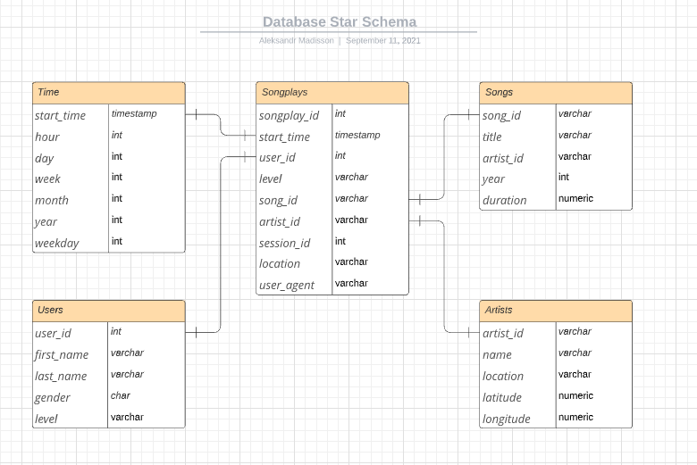

# Project: Data Modeling with Postgres
### Introduction
A startup called Sparkify wants to analyze the data they've been collecting on songs and user 
activity on their new music streaming app. The analytics team is particularly interested 
in understanding what songs users are listening to. Currently, 
they don't have an easy way to query their data, which resides in a directory of JSON logs 
on user activity on the app, as well as a directory with JSON metadata on the songs in their app.

They'd like a data engineer to create a Postgres database with tables designed to optimize queries 
on song play analysis, and bring you on the project. Your role is to create a database schema
and ETL pipeline for this analysis. You'll be able to test your database and ETL pipeline 
by running queries given to you by the analytics team from Sparkify and compare your results 
with their expected results.

### Project Description
In this project, you'll apply what you've learned on data modeling with Postgres and build 
an ETL pipeline using Python. To complete the project, you will need to define fact and dimension
tables for a star schema for a particular analytic focus, and write an ETL pipeline that transfers 
data from files in two local directories into these tables in Postgres using Python and SQL.

## Dependencies
Please make you got installed **Python 3**, **Docker** and **Docker Compose**.  
To run scripts you have to have the following packages: **psycopg2**, **pandas**.

## Run Scripts
Run the database first and wait util it's ready to receive connections
```
docker-compose up --build
```
Now you should be able to create tables and run the etl process
```
python3 create_tables.py
```
```
python3 etl.py
```

## Database schema
Json logs and Song data have been transformed into the following star schema.
Here down below the Songplays is a fact table and rest of them are dimension tables.

